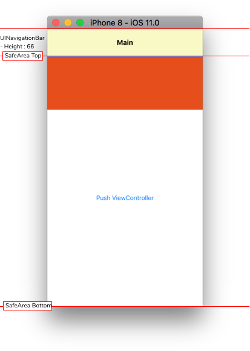
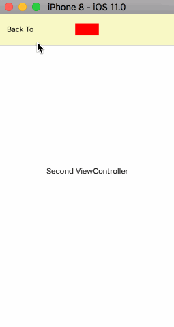

# Custom-NavigationBar-iOS11
Custom Height for UINavigationBar in iOS 10-11

**It is not a library. It is a Sample Project.**

You can customizing UINavigationBar Height in iOS 10 and 11.


Environment

- XCode 9
- Swift 4
- iOS 10
- iOS 11

**Getting Start**

```
git clone git@github.com:ShawnBaek/Custom-NavigationBar-iOS11.git

```

**Related Issues**
- Check Related Issues at [StackOverFlow](https://stackoverflow.com/questions/44387285/ios-11-navigation-bar-height-customizing).
- Check Related Issues at [StackOverFlow](https://stackoverflow.com/questions/46325181/ios-11-unable-to-change-navigation-bar-height/46382032#46382032).

### Results





Height : 66
StatusBar : Hidden


**Don't forget to set SafeArea's top in iOS 11**

```

ViewController.swift

override func viewDidAppear(_ animated: Bool) {

        super.viewDidAppear(false)

        //Important!
        if #available(iOS 11.0, *) {

            //Default NavigationBar Height is 44. Custom NavigationBar Height is 66. So We should set additionalSafeAreaInsets to 66-44 = 22
            self.additionalSafeAreaInsets.top = 22

        }

}

```
